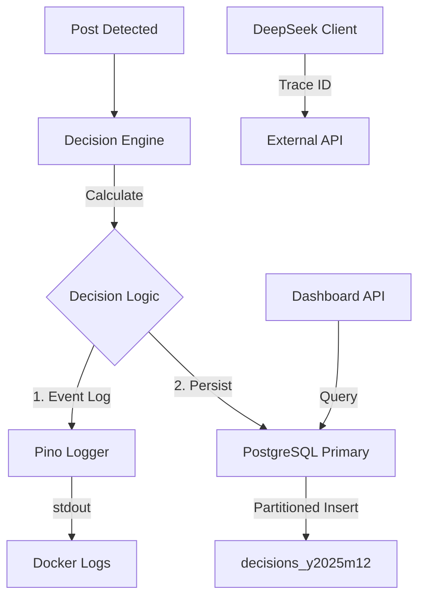

# ADR 008: Decision Audit & Logging Architecture

**Date:** 2025-12-06
**Status:** PROPOSED
**Author:** Winston (Architect Agent)
**Context:** Story 2.8 (Decision Audit & Logging)

## 1. Context

The Antone V2 system requires a robust mechanism to track, audit, and analyze the decisions made by its core Decision Engine. Currently, the system has a basic implementation where:
*   Decisions are stored in a PostgreSQL `decisions` table.
*   Logging is handled by `Pino` but lacks structured separation between operational logs and business audit data.
*   There is no clear strategy for data retention (90 days) or complex analytics (AC7).
*   Distributed tracing is partially implemented (middleware only) but not propagated to external services.

The goal of Story 2.8 is to professionalize this subsystem to support debugging, compliance, and future learning loops.

## 2. Decision

We will adopt a **Separated Concerns Architecture** that explicitly distinguishes between Operational Logging, Business Audit Storage, and Analytics.

### 2.1 Separation of Concerns

| Concern | Purpose | Technology | Retention |
| :--- | :--- | :--- | :--- |
| **Operational Logging** | Debug application flow, monitor health, trace errors. | **Pino (Stdout)** | Short-term (7-14 days via Docker logging driver). |
| **Business Audit** | Permanent record of *what* was decided and *why* (compliance, history). | **PostgreSQL (`decisions` table)** | 90 Days Active + Archive. |
| **Analytics** | Querying patterns, optimizing algorithms. | **PostgreSQL (Indexed)** | Same as Audit (served from same table). |

### 2.2 Data Flow Architecture

## 3. Logging Strategy

We will use **Pino** strictly for operational visibility, not for data storage.

*   **Format:** NDJSON (Newline Delimited JSON).
*   **Context:** Every log must include `requestId` (trace ID).
*   **Levels:**
    *   `INFO`: High-level flow ("Decision cycle started", "Decision finalized").
    *   `WARN`: Expected failures (Circuit breaker open, Safety triggered).
    *   `ERROR`: Unexpected exceptions (DB connection fail, Parsing error).
    *   `DEBUG`: Detailed payloads (Dev only, redacted in Prod).
*   **Redaction:** Strict redaction of PII (user handles, content) in logs. PII belongs in the secured DB, not logs.

## 4. Decision Storage Strategy (PostgreSQL)

We will upgrade the `decisions` table to use **Declarative Partitioning** by Range (`created_at`).

*   **Partitioning:** Monthly partitions (e.g., `decisions_2025_12`).
*   **Rationale:** Allows instant "dropping" of old data (AC5) without expensive `DELETE` operations that bloat the WAL and fragment indexes.
*   **Denormalization:** We will add `platform` to the `Decision` table to speed up filtering without joining `Post`.

### Archiving Strategy
*   **Mechanism:** `pg_dump` of the detached partition → Compressed JSON/SQL on Disk (`/mnt/archive`).
*   **Retention:** 90 Days active (3 monthly partitions). Older partitions are exported and dropped.

## 5. Decision Analytics Strategy

For the scale of a self-hosted single node, we will **not** introduce a separate OLAP database (like ClickHouse) yet. PostgreSQL 17 is sufficient if properly indexed.

*   **Approach:** "Option A: Extended Filters + Indexes".
*   **Optimization:**
    *   Add Composite Indexes: `(platform, mode, created_at)` and `(sss_score, mode)`.
    *   Use JSONB indexing (`gin`) if deep signal querying is needed frequent.
*   **Limitations:** Complex aggregations over millions of rows may be slow; acceptable for "Review" dashboard use cases (< 200ms target).

## 6. Distributed Tracing

*   **Scope:** Extend existing `x-request-id` propagation.
*   **Implementation:**
    *   `DeepSeekClient`: Accept `requestId` in options and send as header.
    *   `QueueWorker`: Extract `requestId` from job payload and set in logger context.

## 7. Performance & Scalability

*   **Indexing:**
    *   `CREATE INDEX idx_decisions_platform_mode_created ON decisions(platform, mode, created_at DESC);`
    *   `CREATE INDEX idx_decisions_sss_score ON decisions(sss_score);`
*   **Estimates:**
    *   Write: < 10ms (Partitioning reduces index maintenance overhead).
    *   Read (Filtered): < 50ms (Covered by indexes).

## 8. Consequences

**Benefits:**
*   **Cleanliness:** Logs aren't cluttered with massive JSON blobs.
*   **Performance:** Partitioning solves the cleanup/archiving performance problem.
*   **Observability:** Full trace visibility into external dependencies.

**Trade-offs:**
*   **Complexity:** Partitioning requires migration management (handled via `pg_partman` or manual scripts).
*   **Migration:** Moving existing non-partitioned data to a partitioned table requires a migration step (renaming old table, creating new partitioned one, backfilling).

**Migration Path:**
1.  Rename existing `decisions` to `decisions_old`.
2.  Create new partitioned `decisions` table.
3.  Backfill recent data (90 days).
4.  Archive/Drop `decisions_old`.