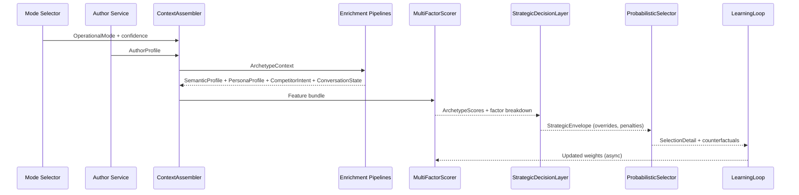

# Story 2.10 Architecture Guidance – Context-Aware Archetype Selection Engine

**Story:** 2.10 Archetype Selection Engine  
**Architect:** Winston  
**Date:** 2025-12-07

---

## 1. Five-Subsystem System Architecture

```mermaid
flowchart LR
    A[Signal Intake Layer\n(mode, author, post, platform, analytics, competitor feeds)]
    B[Context Enrichment Engine\nsemantic + entity analyzers]
    C[Multi-Factor Scoring Matrix\n8 weighted dimensions]
    D[Strategic Decision Layer\npolicy overrides + safety envelope]
    E[Weighted Probabilistic Selector\nTop-N sampler + explanation generator]
    F[Learning & Adaptation Loop\ntelemetry lake + weight optimizer]

    A --> B --> C --> D --> E
    E -->|selection + rationale| A
    E --> F
    F -->|weight adjustments + feature calibrations| C
    F -->|detector feedback| B
```

**Subsystem purposes**
1. **Signal Intake Layer** – Aggregates upstream signals (mode selector, author intelligence, competitor hints, rotation memory, platform metadata) into a normalized `ArchetypeContext`.
2. **Context Enrichment Engine** – Runs semantic, emotional, misinformation, persona-inference, and competitor-model mapping pipelines to produce structured feature vectors with confidence scores.
3. **Multi-Factor Scoring Matrix** – Applies weight-configurable scoring functions for eight dimensions; produces both normalized scores and justification snippets per factor.
4. **Strategic Decision Layer** – Enforces policy overrides (e.g., safety, competitive counter-strategy), applies flexible mode-boundary weighting profiles, and injects smart rotation penalties.
5. **Weighted Probabilistic Selector + Learning Loop** – Samples from top-N archetypes with explainable weights, emits telemetry, tracks outcomes, and feeds the adaptive optimizer that tunes weights and enrichment thresholds.

---

## 2. Component Interfaces & Data Flows

| Component | Interface | Upstream Inputs | Outputs | Notes |
| --- | --- | --- | --- | --- |
| `ContextAssembler` | `buildContext(decisionRequest: DecisionSignals): ArchetypeContext` | Mode selector, author service, content ingestion, competitor monitor, rotation cache | Unified `ArchetypeContext` + metadata such as freshness timestamps | Validates required signals; supplies default placeholders so downstream never fails (“graceful fallback”). |
| `SemanticProfilePipeline` | `run(context: ArchetypeContext): SemanticProfile` | Raw content, author handle/bio, thread metadata | Emotion vector, urgency score, misinformation probability, stance | Uses hybrid LLM + lightweight classifiers; caches per-post results for 30 minutes. |
| `AuthorPersonaRefiner` | `derivePersona(authorSignals): PersonaProfile` | Author tags, follower graph, behavioral history | Primary + secondary personas, receptiveness estimate, relationship stage | One-hot + continuous features to scoring matrix. |
| `CompetitorStrategyEngine` | `mapCompetitorSignals(context): CompetitorIntent` | Competitor detector feed, current conversation participants | Detected competitor archetype, aggressiveness, recommended counter weights | Maintains taxonomy to align counter strategies with our archetypes. |
| `ConversationStateTracker` | `summarize(threadState): ConversationState` | Platform thread API, historical decision log | Thread depth, reply cadence, platform culture bias coefficient, cooldown hints | Lives in Redis Streams for rolling windows. |
| `MultiFactorScorer` | `score(features): ArchetypeScores` | SemanticProfile, PersonaProfile, CompetitorIntent, ConversationState, mode weights, performance stats | Score tuple for each archetype with factor breakdown + normalized confidence | Implements 8-factor weighted scoring; supports dynamic weight profiles per mode. |
| `StrategicDecisionLayer` | `applyPolicies(scores): StrategicEnvelope` | ArchetypeScores, safety rules, override registry, rotation history | Policy-adjusted scores, forced overrides, fallback chain | Applies hard overrides (misinformation, compliance), additive penalties (rotation, saturation). |
| `ProbabilisticSelector` | `select(envelope): SelectionDetail` | StrategicEnvelope, explanation templates | `{ archetype, reason, confidence, alternatives[] }` | Samples via Boltzmann softmax with temperature derived from score variance. |
| `LearningLoop` | `recordOutcome(selection, outcomeMetrics)` and `optimizeWeights()` | SelectionDetail, dashboard analytics, engagement metrics | Weight updates, rotation penalty adjustments, enrichment calibration | Runs asynchronously (nightly job) with guardrails to limit drift (±10% per iteration). |

Flow summary: Decision request enters `ContextAssembler`, flows through enrichment components to assemble features, which are scored, policy-adjusted, sampled, and finally logged + fed into learning telemetry. Each component emits debug traces to Observability mesh.

---

## 3. Eight-Factor Scoring Algorithm

**Scoring model**

For archetype `a`, score is:

```
score_a = Σ_i ( w_i(mode, platform) × f_i(a, context) ) + rotationPenalty_a + performanceBias_a
confidence = σ(score_a / Σ(score_topN))
```

| Factor | Description | Input Signals | Weight Range (per mode) | Function Notes |
| --- | --- | --- | --- | --- |
| F1 Mode Intent Alignment | Ensures archetype respects operational mode goals | Mode selector output, platform constraints | Helpful: 0.20–0.28, Engagement: 0.25–0.35, Hybrid: 0.18–0.26 | Uses cosine similarity between mode-weight vector and archetype personality vector. |
| F2 Semantic Resonance | Measures emotional tone, urgency, misinformation risk | SemanticProfile (emotion, urgency, toxicity) | 0.15–0.22 | Penalizes mismatched tone (+ bonus for empathy when desperation). |
| F3 Author Persona Fit | Aligns with primary/secondary personas, receptiveness | PersonaProfile | 0.10–0.18 | Weighted Jaccard alignment + relationship-stage gating. |
| F4 Competitor Counter Strategy | Responds to competitor archetypes or tactics | CompetitorIntent | 0.08–0.15 | Adds or subtracts weight to archetypes that neutralize competitor framing. |
| F5 Conversation State | Considers thread depth, cooldown, platform culture | ConversationState | 0.08–0.14 | Adds entropy penalty when thread saturated; boosts novelty if thread stale. |
| F6 Performance Memory | Prior engagement metrics per archetype vs audience slice | Telemetry store | 0.08–0.13 | Rolling 7-day win rate; includes diminishing returns logic. |
| F7 Safety & Compliance | Ensures safe tone for flagged contexts (misinfo, sensitive) | Safety policies, ML classifiers | 0.05–0.12 | Hard override for critical cases; otherwise multiplies final score by (1 - risk). |
| F8 Rotation & Novelty | Smart rotation referencing last-N usage | Redis rotation cache | 0.05–0.10 | Penalties decay exponentially rather than binary exclusion; Myth-bust exemption. |

**Weighted Probabilistic Selection**
1. Sort by `score_a`.
2. Take top-N (default 4, padded if fewer available).
3. Apply temperature-scaled softmax: `P(a) = exp(score_a / τ) / Σ exp(score_topN / τ)` where `τ` ∈ [0.6, 1.0] determined by score spread.
4. Sample, log `reason` string containing top 3 contributing factors, include alternative candidates for transparency.
5. If all scores collapse (e.g., missing data), fallback weights rehydrate from default profile and degrade gracefully to deterministic mode archetype order.

---

## 4. Strategic Decision Layer Behaviors

1. **Flexible Mode Boundaries:** Each mode references a weight profile rather than a hard pool. Archetypes outside the typical mode can still surface when their composite score surpasses a configurable margin (default +0.08).
2. **Smart Rotation:** Maintains penalty curve `penalty = -μ × e^( -k × age )`. μ set to 0.12, k to 0.35; ensures gentle decay rather than binary ban.
3. **Safety Overrides:** When semantic analyzer flags misinformation risk >0.72 or sensitive topic requiring compliance, `StrategicDecisionLayer` enforces archetype(s) defined by policy table (e.g., `MYTHBUST`), bypassing probabilistic sampling but still logging suppressed candidates.
4. **Competitive Posturing:** If competitor archetype is aggressive or fear-based, layer boosts empathetic or evidence-heavy archetypes to reposition conversation.

---

## 5. Integration Points

| External System | Integration Details |
| --- | --- |
| **Mode Selector (Story 2.5)** | Provides `OperationalMode` + confidence; influences weight profile and F1 weighting. Interface: `GET mode-service/modes/:postId`. Cache TTL 5 minutes. |
| **Author Detection (Story 2.2)** | Supplies persona tags, inferred attributes, follower tiers. Delivered via `AuthorProfileService` gRPC method `GetAuthorContext`. |
| **Competitor Detection Pipeline** | Consumes competitor mentions / handles, outputs `CompetitorIntent`. If missing, `ContextAssembler` sets neutral profile but still records low-confidence reason to maintain explainability. |
| **Rotation Store** | Uses Redis (existing) but now stores `(archetype, timestamp, postMode, authorCluster)` to enable smarter decay. |
| **Analytics / Performance Dashboard** | Receives `SelectionDetail` events via Kafka topic `decision.archetype.selected`; downstream uses for dashboard (AC10) and Learning Loop ingestion. |
| **Safety / Compliance Engine** | Notified when overrides happen; also supplies latest policy rules to Strategic Decision Layer via shared config file in Consul. |

---

## 6. Component Interfaces Diagram



---

## 7. Performance & Resilience Considerations

* **Caching:** Semantic analysis results cached per post; author persona inference cached per author for 12 hours; competitor mappings cached for 30 minutes. Weight profiles stored in-memory with watch on config change.
* **Async Pipelines:** Learning loop, analytics emission, and heavy semantic enrichment tasks can run asynchronously via message queue. Selector uses latest available enrichment but will substitute defaults if pipeline latency exceeds 200ms.
* **Graceful Fallbacks:** Each subsystem produces “confidence” metadata. If any subsystem <0.4 confidence, weights adjust to favor safer archetypes (Checklist/Coach). If enrichment fails entirely, revert to deterministic mode ranking with rotation penalty still active.
* **Throughput Scaling:** Enrichment workers sharded by platform; scoring + selection components are stateless and can scale horizontally. Redis rotation key includes shard to prevent hotspots.

---

## 8. Observability Strategy

* **Structured Logging:** Every selection logs JSON with `requestId`, top factors, selected archetype, candidate list, override flags, rotation penalties applied.
* **Metrics:**  
  - `archetype_selector.selection_latency_ms` (histogram).  
  - `archetype_selector.factor_score{factor="F1"}` (gauge).  
  - `archetype_selector.override_count{type="safety|competitor|rotation"}`.  
  - `archetype_selector.temperature` (when sampling).  
  - `archetype_selector.fallback_mode_count`.
* **Tracing:** OpenTelemetry span names `ContextEnrichment`, `MultiFactorScoring`, `StrategicDecision`, `ProbabilisticSelection`. Attach factor breakdown as span attributes for debugging.
* **Debug Dashboard:** Extend Story 2.10 dashboard to show distribution + performance; add “Explainability Explorer” panel that surfaces last 50 selections with factor breakdown and overrides.

---

## 9. Delivery Checklist

1. Implement new module structure under `backend/src/generation/archetype-selection/` with submodules per subsystem.
2. Build feature vector schema and scoring weights config file (`config/archetype-scoring.yaml`).
3. Integrate telemetry events with analytics topic.
4. Provide documentation snippet for developer onboarding referencing this architecture and ADRs 009–012 (below).

---
