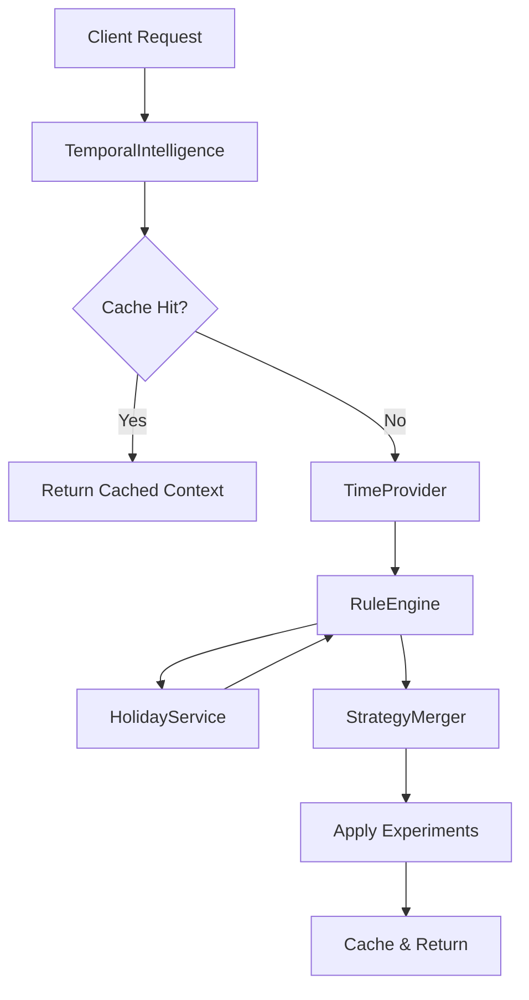

# Temporal Intelligence Engine Architecture

## Overview
The Temporal Intelligence Engine is a rule-based system designed to optimize engagement strategies based on time-of-day, day-of-week, and holiday patterns. It adjusts monitoring frequency, engagement modes, and content archetypes to align with user behavior (e.g., "Peak Suffering" on Sunday mornings).

## Core Components

### 1. TemporalIntelligence
The main entry point/facade that coordinates the evaluation process.
- **Responsibility**: Orchestrates time provision, rule evaluation, strategy merging, and caching.
- **Key Method**: `getTemporalContext(date?)`

### 2. RuleEngine
Evaluates a set of configured rules against the current temporal context.
- **Input**: `TemporalContext` (time, day, holiday status)
- **Output**: List of matched `TemporalRule` objects
- **Logic**: Iterates through rules sorted by priority (descending). Supports `time_range`, `holiday`, `pre_holiday`, and `post_holiday` conditions.

### 3. StrategyMerger
Combines multiple matched strategies into a single coherent strategy.
- **Logic**:
  - `monitoringMultiplier`: Max value wins (conservative approach to ensure coverage).
  - `isPriority`: OR logic (true if any rule sets it).
  - `phase`: Takes phase from highest priority rule.
  - `sssThresholdAdjustment`: Sums adjustments.
  - `archetypePreferences`: Unions preferences.

### 4. HolidayService
Provides holiday awareness using RRULE (recurrence rules).
- **Config**: `temporal-holidays.json`
- **Logic**: Determines if a given date falls on a holiday, or in pre/post windows.

### 5. TimeProvider
Abstracts time and timezone handling.
- **Implementations**: `LuxonTimeProvider` (production), `MockTimeProvider` (testing).
- **Default Timezone**: `America/New_York` (configurable via `TARGET_TIMEZONE`).

## Rule Evaluation Flow

## Data Flow
1. **Input**: Timestamp (Date object)
2. **Contextualization**: Converted to local time in target timezone (e.g., Sunday 09:00 EST).
3. **Matching**: Checked against active rules (e.g., "Sunday Morning Peak").
4. **Merging**: Strategies merged (e.g., Multiplier=3.0, Phase=PeakSuffering).
5. **Integration**:
   - **StreamMonitor**: Adjusts poll interval (Base / Multiplier).
   - **DecisionEngine**: Adjusts SSS thresholds and selects archetypes.

## Performance Characteristics
- **Latency**: < 0.1ms (p99) for cached results; ~0.005ms (p99) for evaluation (benchmark: 10k ops in ~50ms).
- **Throughput**: Scalable to > 150,000 evaluations/sec (benchmark: ~220k/sec).
- **Caching**: 60s default TTL (configurable).
